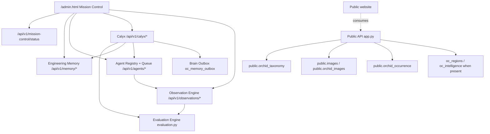

# BUILD-INFRA-003 - Mission Control Activation & Science Pipeline Integration

**Repository:** `jsp1440/orchid-continuum-control-panel`  
**Date:** 2026-07-07  
**Status:** Implemented repository-local operational inventory and Mission Control landing integration.

## 1. Overall Architecture Diagram

## 2. Operational Subsystem Inventory

The canonical machine-readable inventory is now `GET /api/v1/mission-control/status`.

| Subsystem | Status | Evidence |
|---|---|---|
| Engineering Memory | Operational | `memory.py`, `engineering-memory.html`, `/api/v1/memory/decisions` |
| Brain Outbox | Partially implemented | `oc_memory_outbox`, `/api/v1/memory/outbox`, optional `BRAIN_SYNC_ENDPOINT` |
| Observation Engine | Operational | `observation.py`, `/api/v1/observations/*`, Agent Queue runner |
| Evaluation Engine | Operational | `evaluation.py`, `/api/v1/calyx/evaluate`, `test_evaluation.py` |
| Mission Brief | Operational | `calyx.py`, `/api/v1/calyx/mission-brief` |
| Agent Registry | Operational | `agents.py`, `oc_agent_registry` |
| Agent Queue | Operational | `oc_agent_tasks`, `/api/v1/agents/{agent_key}/run` |
| Findings | Operational | `oc_agent_findings`, `/api/v1/agents/{agent_key}/findings` |
| Health Dashboard | Partially implemented | `/health`, `/db/ping`, `/api/brain/status` |
| Repository Status | Pipeline not yet implemented | Disabled Mission Control card; no GitHub-backed API exists |
| Deployment Status | Partially implemented | `render.yaml`, `RENDER_GIT_COMMIT` observation only |
| Scheduled Jobs | Pipeline not yet implemented | Agent runs are manual; `scheduled_scan_stub()` is not a scheduler |

## 3. Science Pipeline Inventory

| Pipeline | Status | Current source | Endpoint | Blocker |
|---|---|---|---|---|
| Taxonomy | Partially implemented | `public.orchid_taxonomy` | `/api/species/search`, `/api/species/metrics` | No scheduler or freshness observation |
| Images | Partially implemented | `public.images`, `public.orchid_images` | `/images/genus/{genus}`, featured gallery | Harvester state not surfaced in Mission Control |
| Atlas | Partially implemented | `oc_regions`, `oc_intelligence`, fallback images | `/api/orchid-widgets/region-*` | Region enrichment tables may be absent |
| Occurrences | Partially implemented | `public.orchid_occurrence` | `/api/species/metrics` | Count-only consumption |
| Habitat | Partially implemented | `oc_regions.region_habitats` when present | `/api/orchid-widgets/region-profile` | No freshness/coverage observation |
| Species | Partially implemented | Taxonomy + images | `/api/species/*` | Dossier sections are pending real tables |
| Homepage | Partially implemented | API endpoints in `app.py` | `/api/genus/daily`, `/api/species/featured`, widgets | Public site repo integration is separate |
| Knowledge Graph | Pipeline not yet implemented | None | None | No graph tables/endpoints/runner |
| Literature | Pipeline not yet implemented | None | None | No source, table, endpoint, or runner |
| Pollinators | Pipeline not yet implemented | None | None | No relationship source |
| Mycorrhiza | Pipeline not yet implemented | None | None | No relationship source |
| Climate | Pipeline not yet implemented | None | None | Region profile only reports pending enrichment |
| Conservation | Pipeline not yet implemented | None | None | Dossier reports pending layer |
| Education | Pipeline not yet implemented | None | None | Disabled landing card only |

## 4. Integration Matrix

| Consumer | Current source | Desired Mission Control source | Missing integration |
|---|---|---|---|
| Featured Genus | `/api/genus/daily` | Mission Control genus packet | Freshness/scheduler signal |
| Featured Species | `/api/species/featured` | Species pipeline | Editorial selection table |
| Hero Image | Genus image endpoints | Image pipeline | Curated hero-image policy |
| Image Rotation | `/api/orchid-widgets/featured-gallery` | Image pipeline | Rotation history/scheduler |
| Science Cards | `/api/genus-story/{genus}` shell | Science pipeline inventory | Literature/pollinator/mycorrhiza/conservation sources |
| Knowledge Graph | None | Knowledge graph pipeline | API, tables, runner |
| Habitat Cards | `oc_regions.region_habitats` when present | Habitat pipeline | Availability and freshness observations |
| Atlas | `/api/orchid-widgets/region-*` | Atlas pipeline | Operational rollup |
| Statistics | `/api/species/metrics` | Metrics pipeline | `genera_count`, `countries_count`, `last_updated` remain null |
| Pollinators | None | Pollinator pipeline | API, tables, runner |
| Mycorrhiza | None | Mycorrhiza pipeline | API, tables, runner |
| Literature | None | Literature pipeline | API, tables, runner |
| Education | None | Education/OCU pipeline | Operational model |

## 5. Blocking Issues

- GitHub write/push/PR creation may still be blocked by the permission issue documented in `BUILD-002-Push-Report.md`.
- `DATABASE_URL` is required for live table counts and health. Without it, the status API reports repository-local inventory and an explicit database blocker.
- Repository status needs a real GitHub integration. No local table or endpoint exists today.
- Render deployment status is limited to `render.yaml` and `RENDER_GIT_COMMIT`; no deployment event history exists.
- Scheduled jobs are not implemented. Agent runs are manual.

## 6. Missing Integrations

- Brain Outbox drain/retry adapter.
- GitHub repository/PR/CI status integration.
- Render deployment status integration.
- Harvester heartbeat/run-state dashboard.
- Literature, pollinator, mycorrhiza, conservation, climate, and education source contracts.
- Observation Engine history feeding Evaluation Engine directly.

## 7. Recommended Next Five Builds

1. Expose harvester heartbeat and run state in Mission Control.
2. Add repository/deployment status from real GitHub and Render integrations.
3. Implement Brain Outbox drain/retry adapter.
4. Connect Observation Engine history into Evaluation Engine scoring.
5. Define the first real literature or pollinator pipeline table/API contract.

## 8-11. Deployment Flags

| Question | Answer | Evidence |
|---|---|---|
| Frontend deployment required? | No | This repo serves static admin HTML directly; no separate frontend build exists. |
| Backend deployment required? | Yes | `operational.py` and `app.py` add a new backend API route. |
| Database migration required? | No | No new database tables are required by this build. |
| Render configuration changes required? | No | `render.yaml` remains sufficient for the FastAPI service. |

## 12. Overall Operational Readiness Score

The new status API computes readiness from repository evidence:

`Operational=1.0`, `partially_implemented=0.5`, `placeholder=0.15`, and disconnected/missing/not-yet-implemented systems as `0.0`, across Mission Control modules and science pipelines.

The score is generated at runtime in `/api/v1/mission-control/status` so it can update as modules move from partial to operational.

## 13. Confidence Assessment

High confidence for repository-local inventory because each conclusion cites files, routes, tables, environment variables, or explicit disabled cards in this repository. Medium confidence for live database availability when `DATABASE_URL` is absent or unreachable in the execution environment.
